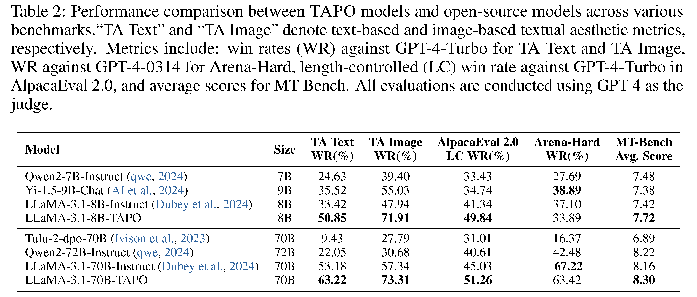

# Textual Aesthetics in Large Language Models
This repository contains the codes and data for the paper "Textual Aesthetics in Large Language Models". The code will be released soon. Please stay tuned for updates. The [TexAes](https://huggingface.co/datasets/lingjie23/TexAes) dataset, which we developed for our research, is now available on Hugging Face. 

## Abstract
Image aesthetics is a crucial metric in the field of image generation. However, textual aesthetics has not been sufficiently explored. With the widespread application of large language models (LLMs), previous work has primarily focused on the correctness of content and the helpfulness of responses. Nonetheless, providing responses with textual aesthetics is also an important factor for LLMs, which can offer a cleaner layout and ensure greater consistency and coherence in content. 
n this work, we introduce a pipeline for aesthetics polishing and help construct a textual aesthetics dataset named TexAes. We propose a textual aesthetics-powered fine-tuning method based on direct preference optimization, termed TAPO, which leverages textual aesthetics without compromising content correctness. Additionally, we develop two evaluation methods for textual aesthetics based on text and image analysis, respectively.
Our experiments demonstrate that using textual aesthetics data and employing the TAPO fine-tuning method not only improves aesthetic scores but also enhances performance on general evaluation datasets such as AlpacalEval and Anera-hard.

## TAPO Powered Models
The comparative analysis of our models trained with TAPO on TexAes against open-source models is shown in Table2. Our LLaMA-3.1-8B-TAPO model surpasses all open-source counterparts in both text-based and image-based text aesthetic metrics, with an 18.88% improvement in text-based scores and a 27.85% enhancement in image-based scores over the best-performing LLaMA-3.1-70B-Instruct model. 

## Links
- [TexAes](https://huggingface.co/datasets/lingjie23/TexAes)